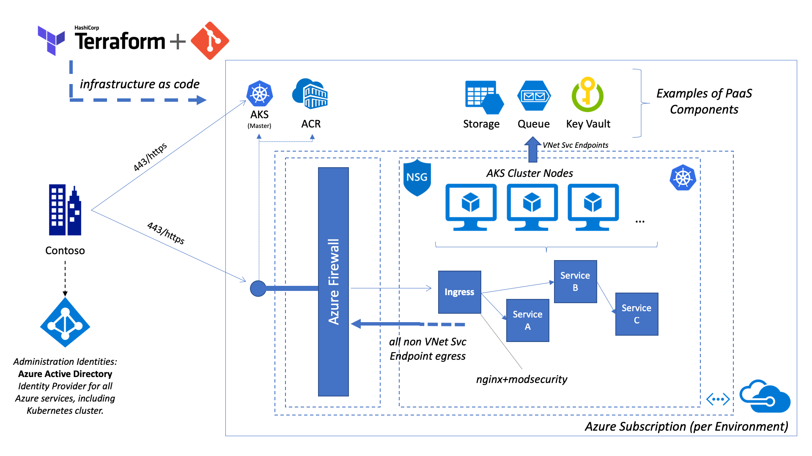

# End-to-End Azure Kubernetes Service (AKS) Deployment using Terraform

This is an end-to-end sample on how to deploy the [Azure Kubernetes Service (AKS)](https://azure.microsoft.com/en-us/services/kubernetes-service/) using [Terraform](https://www.terraform.io/).

## Overview

This diagram provides a rough overview of the deployed infrastructure:


Please note that the additional services like Azure Key Vault and Azure Storage depicted here and just example on PaaS components that can be integrated into the solution.

## Getting Started

The easiest way, to start get the whole environment setup and deployed is by running the `apply_all.sh` script. However, first you have to **ensure the following preconditions**:

1. [Terraform](https://www.terraform.io/) is installed in the latest version. Check via `terraform version`.
1. [Kubectl](https://kubernetes.io/docs/tasks/tools/install-kubectl/#install-kubectl) is installed in the latest version. Check via `kubectl version`.
1. [Helm](https://github.com/helm/helm) is installed in the latest version. Check via `helm version`.
1. [Azure CLI (az)](https://docs.microsoft.com/en-us/cli/azure/install-azure-cli?view=azure-cli-latest) is installed in the latest version and points to the correct subscription. Check via `az account list` what is configured as `"isDefault": true`. This is important as due to one missing feature in the Terraform Azure Firewall resource provider, we have to fallback to invoke `az` from Terraform.
1. [Azure CLI Firewall Extension](https://docs.microsoft.com/en-us/cli/azure/extension?view=azure-cli-latest#az-extension-add). As mentioned above, in one step we need to fallback to the Azure CLI. Please make sure the Azure Firewall extension is installed: `az extension add --name azure-firewall` or make sure it is up-to-date: `az extension update --name azure-firewall`
1. Create a client and server application registration in Azure Active Directory to support Kubernetes OIDC integration. In short, this allows you to use Azure AD as your identity provider to manage cluster access. Follow [these steps](https://docs.microsoft.com/en-us/azure/aks/aad-integration) and retrieve the required setting information. Hint: You do not need to create multiple of these registration in your environment, but you should hand out individual secrets.
1. Enable the AKS Audit Log **feature flag** in your subscription as described in the *Note* field in the [official documentation](https://docs.microsoft.com/en-us/azure/aks/view-master-logs). **Only register the flag, all actual diagnostic configuration is fully automated during the deployment.**

When all preconditions are met, you need to gather the required input variables in a file, e.g. `secrets.dev.tfvars`. The following variables are **mandatory** to provide:

```hcl
aad_server_app_id="00000000-0000-0000-0000-000000000000"
aad_server_app_secret="PatVMovW........WXJyV5fw="
aad_client_app_id="00000000-0000-0000-0000-000000000000"
aad_tenant_id="00000000-0000-0000-0000-000000000000"

aks_cluster_admins = ["john@contoso.com", "jane@contoso.com"]
```

Finally you can execute the complete deployment process. `-e` denotes an environment like DEV, QA or PROD. `-p` denotes a prefix like your project name. `-v` points to the `context.tfvars` file discussed earlier:

```sh
./apply_all.sh -e dev -p contoso -v ./context.tfvars
```

> If you would like to run the deployments individually instead of using the apply_all.sh script, feel free to look into the script file and take out the bits and pieces which are useful to you.

## Deployment Structure

The deployment structure is basically divided into two parts. The first part takes care of the Azure Resources, the second part takes care of the Kubernetes side.

- `00-tf-backend`

   Configures the terraform azure backend state provider. It generates a local set of tfvars files `{envName}_backend.tfvars` that defines the Azure Storage account backend location for the terraform state.

- `01-env` (optional)

    An optional preparation step that creates the required service principals for the deployment. It creates a local secret tfvars file in `02-aks`. The secret file is git-ignored and can be used to as a parameter input file for the actual AKS deployment in `02-aks`.

    > Required rights for execution: Allowance to create Azure Service Principals in your Azure AD tenant, see [Azure Docs](https://docs.microsoft.com/en-us/azure/active-directory/develop/howto-create-service-principal-portal#required-permissions).

- `02-aks`

    The actual deployment of an AKS cluster, an Azure Firewall, and the baseline network infrastructure.

    > Requires that the executing entity has the Azure RBAC permission *Owner* on the target subscription.

-----------

- `03-aks-post-deploy`

    After completing the Azure resource deployment, the post deploy step configures the Kubernetes cluster role bindings and prepares the helm service account.

    > Requires cluster-admin rights on Kubernetes.

- `04-aks-post-deploy-ingress` (optional)

    This post deploy step configures the Kubernetes environment to support Azure Pod Identity and the Azure nginx Ingress option. Please note, that this step is completely optional. Feel free to setup a manual integration.

    > Requires cluster-admin rights on Kubernetes.

- `10-deployment-sample` (optional)

    An optional example to verify the deployment. It exposes an echo service.

    > Requires cluster-admin rights on Kubernetes.

-----------

- `99-externals` (ignore for the moment)

    Git sub-module which currently links to the aad-pod-identity GitHub repository. As soon as the aad-pod-identity project issues a proper remote Helm chart, the reference can be removed.

## Disclaimer

This sample deploys AKS in combination with Azure Firewall and nginx ingress. Please note, that Microsoft does not officially support an AKS setup in combination with Azure Firewall.

## Misc

### Getting AKS Admin credentials

```sh
az aks get-credentials --resource-group <TODO> --name <TODO> --admin --overwrite-existing
```

### Getting AKS User credentials

```sh
az aks get-credentials --resource-group <TODO> --name <TODO> --overwrite-existing
```
